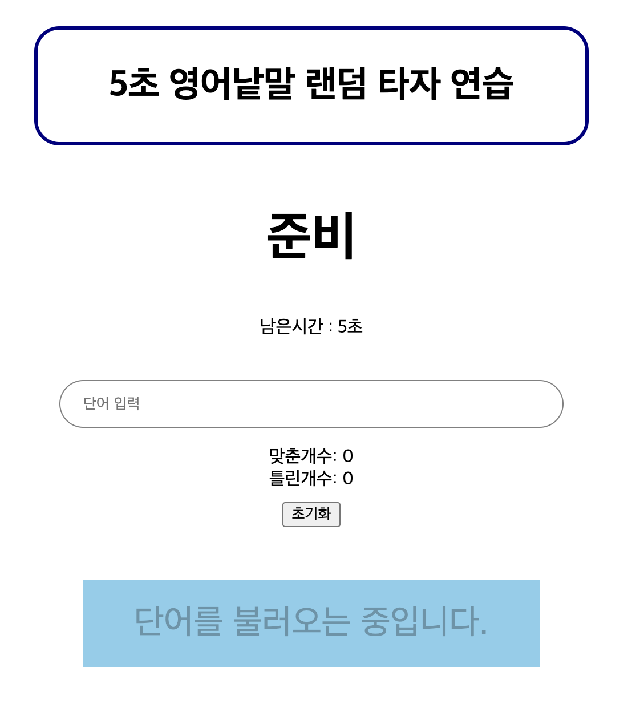

# 5초 영어낱말 랜덤 타자 연습

1. 5초 안에 랜덤으로 나오는 영어 낱말을 동일하게 입력해야 맞춘개수가 1씩 증가한다
2. 표시된 단어와 다른 값을 입력하면 틀랜수가 1씩 증가한다
3. 시작/정지 버튼을 누르면 단어가 표시되고 사라짐을 동작한다.
4. 공백을 입력하면 단어를 입력하라는 alert가 표시된다.
5. 초기화 버튼을 누르면 맞춘개수와 틀린개수가 0으로 초기화된다
6. 5초의 시간이 흐르면 정지되며 남은시간은 5초로 초기화된다x

# skills

javascript, react, axios, styled-componenets, react hooks, yarn

# run

1. npm i
2. yarn start

# 프로젝트를 경험하면서 느낀점

1. props의 한계와 useContext와 redux의 필요이유에 대해 알게됨
2. react hooks의 사용법 또는 리렌더링 조건에 대해 더 자세히 알게됨

# 구현 이미지

1. api 불러오기전 "단어를 불러오는 중입니다."라는 버튼을 표시하고 비활성화
2. "준비" 라는 글자를 표시
   
3. api를 불러오면"시작"이라는 버튼으로 변경 후 활성화
4. "준비" 글자 삭제
   
5. "시작" 버튼을 누르면 남은시간이 카운팅되고 위에 불러온 영어 낱말이 표시됨.
   
